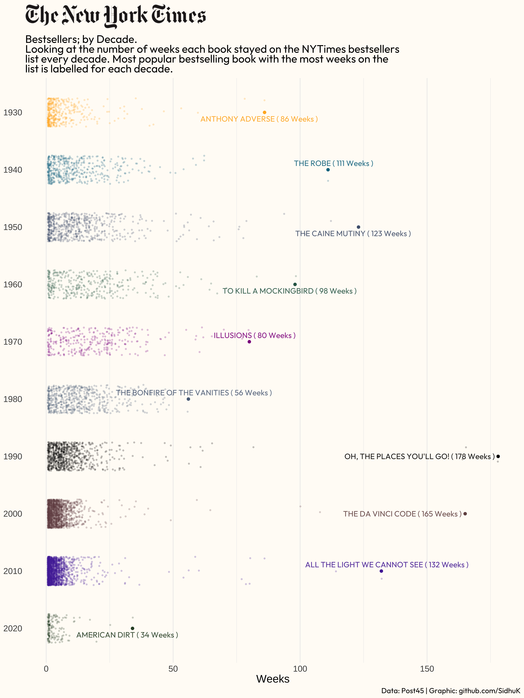
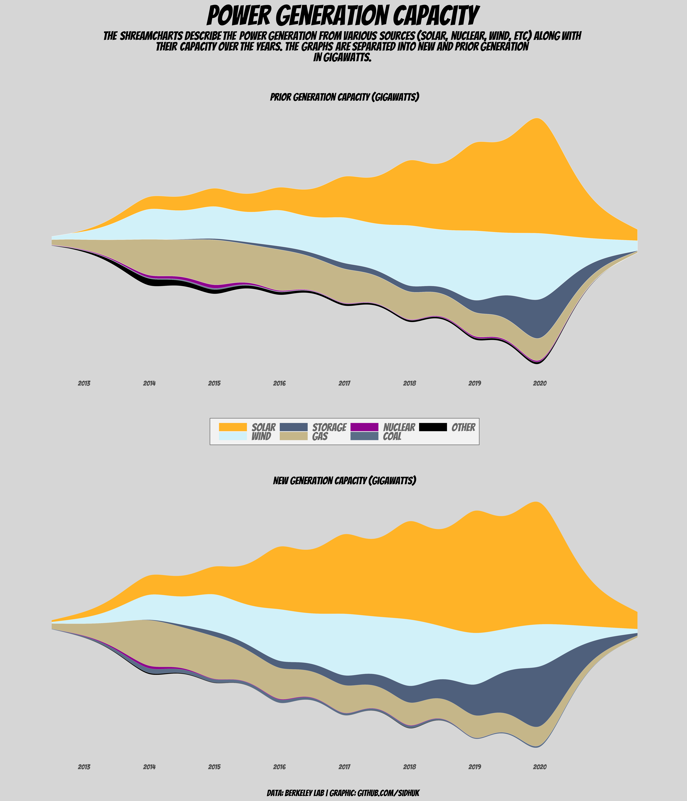
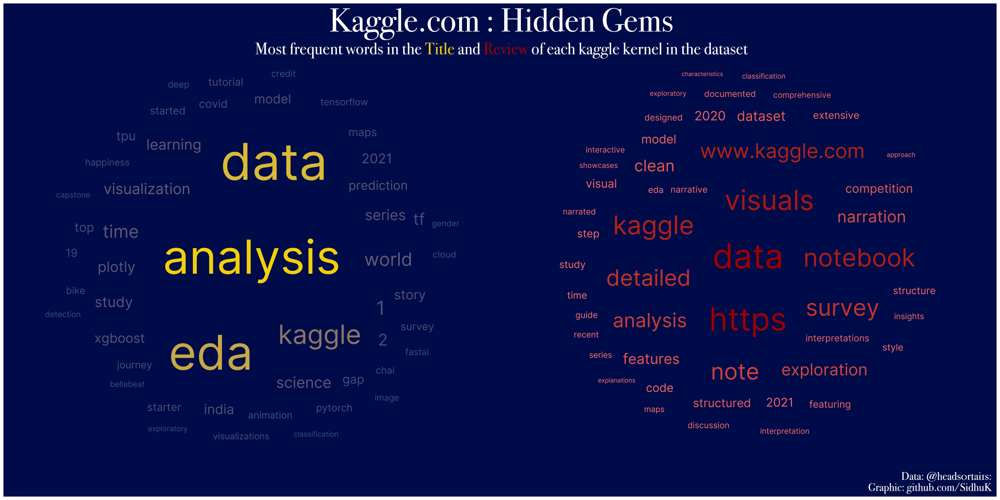
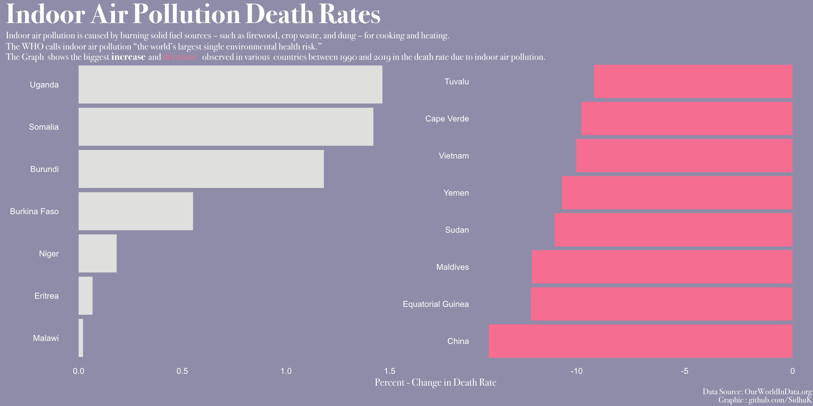

# TidyTuesday

My contributions to the weekly tidytuesday datasets.

## May 10 2022 - NYTimes Bestsellers

## May 03 2022 - Power Sources and their Capacity

## April 26 2022 - Kaggle.com Hidden Gems

## April 19 2022 - Times Crossword Puzzle Answers

## April 12 2022 - Fossil Fuels - Indoor Death Rates

 

## April 05 2022 - Digital News Organizations

  

## March 29 2022 - College Sports

 
 
 
 ## March 22 2022 - Baby Names

 

## March 15 2022 - CRAN Packages

